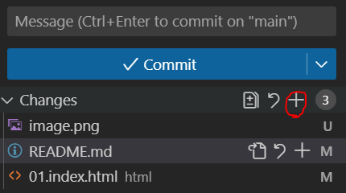
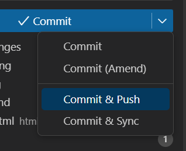

# Git

Para clonar repositorio, vamos al repositorio > Code > SSH y copiamos la URL (`git@... .git`)
```
  git clone <URL>
```

La primera vez que clonais os saldrá el aviso de que no hay un user configurado, entonces:

```
  git config --global user.name "<Nombre>"
```

Es recomendable que coloqueis el email de Github:
```
  git config --global user.email "<email>"
```
Para subir un cambio:
1. Abrir la carpeta en Code 👉(**la carpeta que habéis clonado antes**)
2. Hacéis un cambio en cualquier archivo 👉(**Guardad**)
3. Abrid el icono de control de cambios: 
4. Usamos el icono del + para añadir todo:

5. Escribimos un mensaje que explique qué hemos hecho
6. Commit & push

7. gg ez