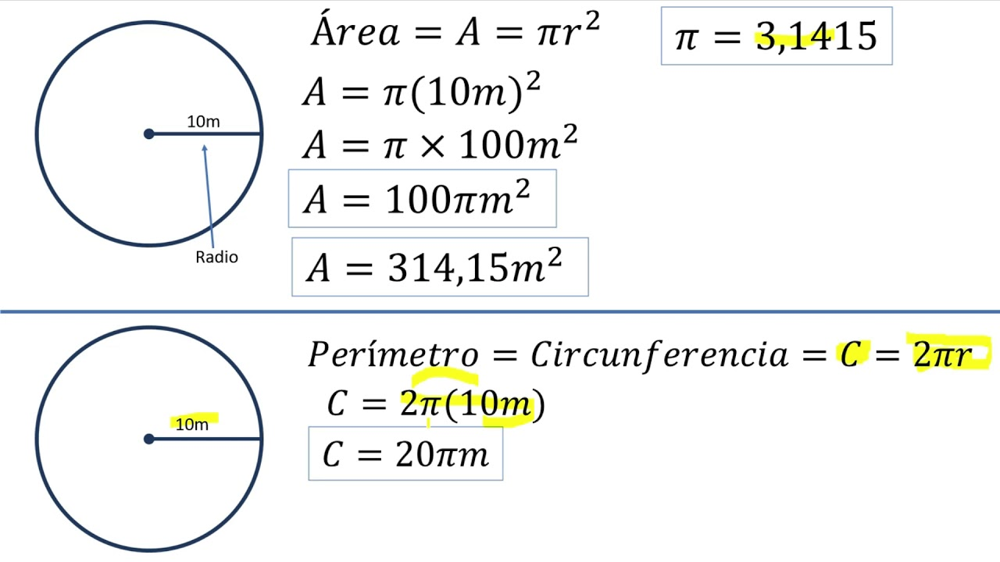
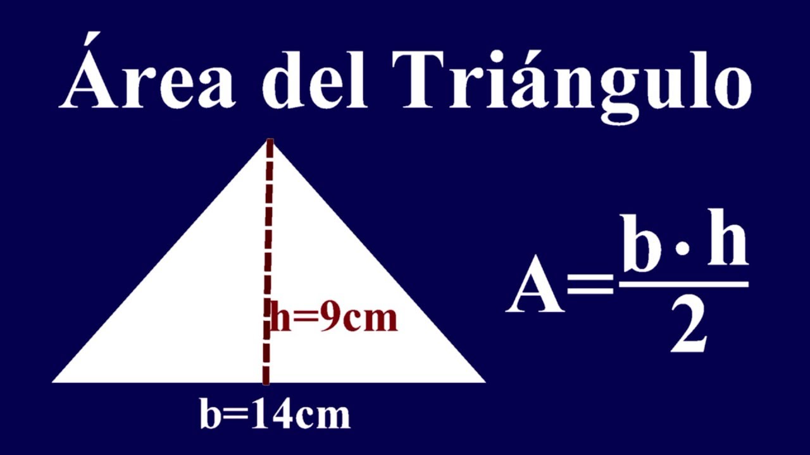
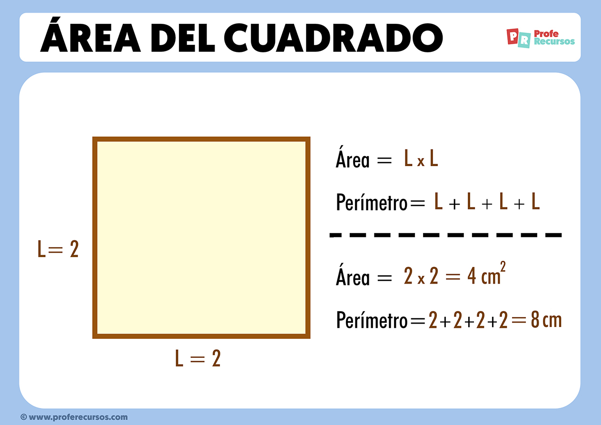

# Ejercicios de Operadores


## Operadores Aritméticos

1. Calcula el resultado de las expresiones:

Este apartado tiene operaciones numéricas que hay que calcular. Dependiendo de las prioridades o el orden de las operaciones el resultado puede variar.

- **Operaciones combinadas:** `10 + 5 * 2` y `(10 + 5) * 2` y `10 + (5 * 2)` -> ¿qué observas?

- **Área del círculo:** `3.14 * r ** 2`, con `r` igual a `10` -> ¿cómo podemos hacer un programa que reciba el radio `r` como dato y devuelva el área de la circunferencia?



1.5. **Notación científica:** `10` elevado a `3` y `10` elevado a `-3` -> ¿qué observas?

2. **Área del triángulo:** Encuentra el área de un triángulo con base 6 y altura 4. -> ¿Cómo harías una calculadora de áreas de triángulos?



3. Determina el resultado de la operación `25 / (5 - 5)`. Al resultado, súmale `10`. ¿Cuál es el problema? ¿Se podría evitar?

4. **Perímetro de un cuadrado:** Encuentra el perímetro de un cuadrado con un lado de longitud 8. ¿Cómo harías una calculadora para este dato a partir del lado? ¿Y el área?



5. **Exponenciación:** Calcula el resultado de `2` elevado a la `3` y `2` elevado a `0` y `0` elevado a `0`. -> ¿Qué observas? ¿Hay algún problema?

**Pista:** un número elevado a cero es el resultado de dividir el número por sí mismo: `5/5 = 5^0` donde `^` es elevado o exponente (operador `**`), siempre que el número no sea `0`.

## Operadores de Asignación

Estos operadores son similares a los aritméticos pero además *guardan* (asignan) el valor del resultado a la variable, siempre se pueden sustituir por la variantes operación y asignación, es decir:

```js
// Operación con asignación:
x = x + 1; // sumar 1 a la x
// Operación con +=
x += 1;
// también suma 1 a x y se lo asigna
```

1. Asigna el valor `10` a una variable `x` y luego incrementa su valor en `3`. ¿Cómo haces esto de dos formas distintas pero equivalentes?

2. Declara una variable `total` con el valor `50` y calcula:

- Restar `10`
- Sumar `21 %`
- Añadir `20` más el `10%` de `20`

**Observación:** es posible resolverlo usando de base `50` o es posible aplicar las operaciones sobre el resultado que vamos obteniendo. El resultado final es distinto en cada caso:

```js
restar 10 -> sumar 21% de 50 -> ... -> resultado_1
// o
restar 10 -> sumar 21% de lo que nos ha salido en el paso anterior -> ... -> resultado_2
// Se puede comprobar que:
resultado_1 != resultado_2 // true
```

¿Cuál es el total final?

3. Inicializa una variable `contador` en `5` y luego multiplícala por `2` cinco veces. 

¿Qué obtienes? ¿A qué operación equivale?

4. Asigna el valor `15` a una variable `y` y luego divídela por `3`, `5`, `7`, `10` (se divide el `15` en cada caso). 

¿Cómo sabes en qué casos la división es exacta (resto `0`)?

5. Declara una variable `saldo` con el valor `100` y calcula:

- Quitar `10 %`
- Restar `15`
- Añadir `12.5 %`
- Dividir por `2`
- Añadir `21 %`

¿Qué obtienes? ¿Qué suposiciones has hecho?

# Operadores de Comparación

1. Comprueba:

- `7 > 3`
- `3 < 7`
- `1 == '1'`
- `1 === '1'`
- `3 != '3'`
- `3 !== 3.0` 

Añade una explicación del resultado de cada comparación.


2. Haz una comparación con la variable `edad` de un usuario de tipo `Number` y entero:

- Es mayor de 18
- Es menor que 18
- Está entre 25 y 35 años
- No es mayor de 65 años
- Tiene entre 13 y 24 años cumplidos

3. Determina si es el caso que una variable numérica entre 5 y 10 cumple:

- Es número positivo
- Tiene hasta 2 dígitos
- Es número par
- Es número impar
- Es divisible por 3

4. Comprueba si el string `Hola, ¿qué tal?`:

- Tiene más de 10 caracteres
- Empieza por `H`
- Tiene algún espacio
- No es nulo o `undefined`
- Tiene más de 5 caracteres

5. Realiza las comparaciones necesarias para verificar si un día (`String`) es:

- Día laboral
- Fin de semana
- Lunes o Jueves
- Viernes
- No lectivo (los martes)

# Operadores de String

1. Concatena las cadenas:

- `Hola, ` y el nombre de un usuario
- `La hora actual es: ` y la salida de `new Date().getHours()` y ` h`
- Para un par de números, haz una suma y concatena: `El resultado de la suma de `, `num1`, `num2`, `es: `, `suma`

2. Calcula la longitud de las cadenas:

- `""`
- `"Hola"`
- `1+1=2`
- `"Hoy es " + diaDeLaSemana` en
```js
const diasDeLaSemana = ['Domingo', 'Lunes', 'Martes', 'Miércoles', 'Jueves', 'Viernes', 'Sábado'];
const diaDeLaSemana = diasDeLaSemana[new Date().getDay()];
// Cadena:
"Hoy es " + diaDeLaSemana
```

3. Concatena:

- Dos números, la suma y el resultado
- Tres números, el promedio y el resultado
- Un número, la raiz cuadrada y el resultado

4. Concatena:

- Dós párrafos de HTML
- Un `<div>` con una lista `<ul>`
- Tres elementos (`<li>`) de una lista con enlaces en una sola variable

5. Concatena:

- Dos datos que llegan de prompt
- El nombre y apellido de un usuario
- Datos de un coche: marca, modelo, año y colócalos formateados en una variable

# Operadores Lógicos

1. Verifica: 
- Si al menos una de las expresiones `(5 > 3)` o `(10 < 8)` es verdadera.
- Si ambas expresiones `(7 === 7)` y `(4 !== 4)` son verdaderas.
- Si ninguna de las expresiones `(3 > 5)` y `(10 < 8)` es verdadera.
- Si la expresión `(20 >= 20)` es verdadera y la expresión `(15 < 10)` es falsa.
- Si al menos una de las expresiones `(10 === "10")` o `(15 !== 15)` es verdadera.

2. **NAND (Negated AND):** Es una operación lógica que produce un valor de salida verdadero (1) solamente cuando al menos uno de sus operandos es falso (0). En otras palabras, la salida es falsa (0) si ambos operandos son verdaderos (1), y verdadera (1) en cualquier otro caso. Haz la tabla de verdad de NAND.

3. **XOR (Exclusive OR):** Es una operación lógica que produce un valor de salida verdadero (1) si los operandos son diferentes, es decir, si uno es verdadero (1) y el otro falso (0). Si ambos operandos son iguales (ambos verdaderos o ambos falsos), la salida es falsa (0). Haz la tabla de verda de `XOR`.

4. Supongamos que tienes cualquier cantidad de puertas lógicas `NAND` y que se te plantea el problema de reproducir el comportamiento de una puerta `AND`, ¿cómo se podría hacer? ¿Qué ventaja puede tener esta *complicación* en el planteamiento?

5. Pide algunos datos por prompts para las variables: `esAdmin`, `estaLogeado`, `esMayorDe18` (puedes usar prompts para pedir los datos o asignar directamente a las variables) y verifica:

- Si es admin y mayor de edad
- Si es admin o mayor de edad
- Si es admin, está logeado y es mayor de edad
- Si es menor de edad y no está logeado
- Si no es admin y si no está logeado


# Operadores Bitwise

1. Comprueba el resultado de este bloque de código:
```js
// Operación de suma normal
let inicioSumaNormal = performance.now(); // Tiempo inicial
let resultadoSumaNormal = 2147483646 + 2147483646; // Operación de suma normal
let finSumaNormal = performance.now(); // Tiempo final
let tiempoSumaNormal = finSumaNormal - inicioSumaNormal; // Tiempo total

console.log("Tiempo de suma normal:", tiempoSumaNormal, "milisegundos");

// Operación de suma bitwise
let inicioSumaBitwise = performance.now(); // Tiempo inicial
let resultadoSumaBitwise = 2147483646 << 1; // Operación de multiplicar por 2 en bitwise
let finSumaBitwise = performance.now(); // Tiempo final
let tiempoSumaBitwise = finSumaBitwise - inicioSumaBitwise; // Tiempo total

console.log("Tiempo de suma bitwise:", tiempoSumaBitwise, "milisegundos");
```

¿Qué ventaja consideras que tienen las operaciones bitwise?

**Conclusión:** solo a veces las operaciones bitwise son más rápidas que las operaciones normales, pero en general, las operaciones bitwise son más rápidas que las operaciones normales.

## Operaciones básicas en Bitwise

### Suma
```js
function sumaBitwise(a, b) {
    while (b != 0) {
        let carry = a & b;
        a = a ^ b;
        b = carry << 1;
    }
    return a;
}
```
### Resta
```js
// a - b
function restaBitwise(a, b) {
    b = ~b + 1;
    return sumaBitwise(a, b);
}
```
### Multiplicación
```js
function multiplicacionBitwise(a, b) {
    let resultado = 0;
    while (b != 0) {
        if (b & 1) {
            resultado = sumaBitwise(resultado, a);
        }
        a <<= 1;
        b >>= 1;
    }
    return resultado;
}
```
### División
```js
function divisionBitwise(a, b) {
    let cociente = 0;
    let signo = ((a < 0) ^ (b < 0)) ? -1 : 1;
    a = Math.abs(a);
    b = Math.abs(b);
    while (a >= b) {
        let tempB = b;
        let tempCociente = 1;
        while (a >= (tempB << 1)) {
            tempB <<= 1;
            tempCociente <<= 1;
        }
        a = restaBitwise(a, tempB);
        cociente = sumaBitwise(cociente, tempCociente);
    }
    return signo * cociente;
}
```

2. Realiza una suma y haz lo mismo con la `sumaBitwise`. **Nota:** para usar la versión bitwise debes copiar el bloque de código y llamarlo así: `sumaBitwise(num1, num2)` con `num1` y `num2` siendo dos variables que hayas definido o puedes pasarle números. ¿Funciona igual que el operador `+`?

3. Prueba este bloque:

```js
let a = 10; // Representación binaria: 1010
let b = 3;  // Representación binaria: 0011

// Suma aritmética
let sumaAritmetica = a + b; // Resultado: 13

// Suma bitwise
let sumaBitwise = a ^ b; // Resultado: 9

console.log("Suma aritmética:", sumaAritmetica); // Resultado: 13
console.log("Suma bitwise:", sumaBitwise);     // Resultado: 9
```

¿Por qué los resultados son diferentes? Haz la comprobación con sumaBitwise(a, b), ¿coincide con la versión aritmética?

4. Intenta sumar `0.1` y `0.2`con `sumaBitwise(a, b)`, ¿qué sucede? ¿Cómo se podría solventar?

5. Desplazamiento de bits. Ejecuta este bloque:

```js
// Multiplicación por 2 de forma normal
function multiplicarPorDosNormal(numero) {
    return numero * 2;
}

// Multiplicación por 2 con desplazamiento de bits
function multiplicarPorDosBitwise(numero) {
    return numero << 1;
}

// División por 2 de forma normal
function dividirPorDosNormal(numero) {
    return numero / 2;
}

// División por 2 con desplazamiento de bits
function dividirPorDosBitwise(numero) {
    return numero >> 1;
}

// Ejemplo de uso
let numero = 10;

console.log("Multiplicación por 2 (Normal):", multiplicarPorDosNormal(numero));
console.log("Multiplicación por 2 (Bitwise):", multiplicarPorDosBitwise(numero));
console.log("División por 2 (Normal):", dividirPorDosNormal(numero));
console.log("División por 2 (Bitwise):", dividirPorDosBitwise(numero));
```

Comparativa de multiplicar por 2:

```js
// Número grande
let numeroGrande = 999999999; // prueba este primero
// let numeroGrande = 12345678901234567890; // --> prueba este después, ¿qué sucede?

// Medir el tiempo para la multiplicación normal
let inicioNormal = performance.now();
let resultadoNormal = multiplicarPorDosNormal(numeroGrande);
let finNormal = performance.now();
let tiempoNormal = finNormal - inicioNormal;

// Medir el tiempo para la multiplicación bitwise
let inicioBitwise = performance.now();
let resultadoBitwise = multiplicarPorDosBitwise(numeroGrande);
let finBitwise = performance.now();
let tiempoBitwise = finBitwise - inicioBitwise;

// Mostrar resultados
console.log("Resultado Multiplicación Normal:", resultadoNormal);
console.log("Tiempo Multiplicación Normal:", tiempoNormal, "milisegundos");

console.log("Resultado Multiplicación Bitwise:", resultadoBitwise);
console.log("Tiempo Multiplicación Bitwise:", tiempoBitwise, "milisegundos");
```

Implementa la comparativa para dividir por `2`.

# Operador Ternario

Sintaxis: `condición ? expresión1 : expresión2`

`expresion1`: Lo que sucede cuando condición es verdadera.
`expresion2`: Lo que sucede cuando condición es falsa.

```js
let edad = Number(prompt("Ingresa tu edad:"));
edad > 18 ? alert("Puedes pasar") : alert("No puedes pasar");
```

1. Utiliza un operador ternario para determinar si un número es positivo o negativo.
```js
    let numero = Number(prompt("Ingresa un número:"));
    let mensaje = numero > 0 ? "Es positivo" : "Es negativo";
    alert(mensaje);
```
2. Utiliza un operador ternario para determinar si un año es bisiesto o no.
```js
    let año = Number(prompt("Ingresa un año:"));
    let mensaje = año % 4 == 0 ? "Es bisiesto" : "No es bisiesto";
    alert(mensaje);
```
3. Utiliza un operador ternario para determinar si un número es divisible por 5.
```js
    let numero = Number(prompt("Ingresa un número:"));
    let mensaje = numero % 5 == 0 ? "Es divisible por 5" : "No es divisible por 5";
    alert(mensaje);
```
4. Utiliza un operador ternario para determinar si un número es mayor, menor o igual que cero.
```js
    let numero = Number(prompt("Ingresa un número:"));
    let mensaje = numero > 0 ? // condición del primer ternario
                            "Es mayor que cero" : // condición verdadera
                                numero < 0 ?      // condición falsa
                                    "Es menor que cero" :  // condición verdadera del segundo ternario
                                    "Es igual a cero";      // condición falsa del segundo ternario
    /*
    let mensaje = numero > 0 
        ? "Es mayor que cero" : numero < 0 
        ? "Es menor que cero" : "Es igual a cero";   
        
    Suele ser mejor:
    if(condición1) {
        // código
    } else if(condición2) {
        // código
    } else {
        // código
    }
    */
    alert(mensaje);
```
5. Utiliza un operador ternario para determinar si una persona es adulta o menor de edad, dado su año de nacimiento.
```js
    let año = Number(prompt("Ingresa tu año de nacimiento:"));
    let mensaje = new Date().getFullYear() - año >= 18 ? "Eres mayor de edad" : "Eres menor de edad";
    alert(mensaje);
```